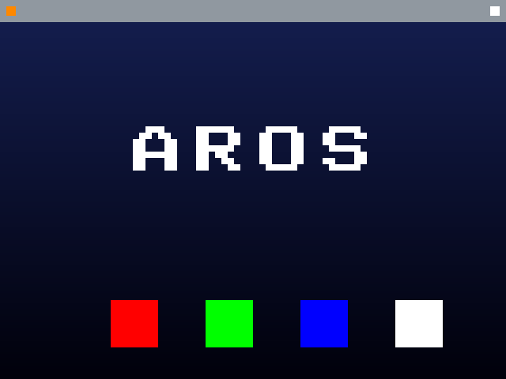

# Phase 2 — Hosted on macOS

The payoff path: AROS as a **native arm64 macOS process**, with macOS owning every
driver (console, memory, later display/input). This is also the de-facto AROS
contribution — upstream's `arch/aarch64-all` is already a *hosted* (`emulation`)
flavour, just unfinished. We complete that, on Apple Silicon.

The loop is even simpler than QEMU: the target IS a Mac process, so "build → run →
observe" is just running the binary and reading stdout (`make hosted-run`).

We de-risk by spiking the scary parts cheapest-first, before committing to the
full port.

Status: ✅ done · 🔜 next · ⬜ planned

### H0/H1 — Foundation ✅
A native arm64 Mach-O process runs our bare-metal `ctx_switch` (now `_ctx_switch`
for Mach-O) at EL0, cooperatively scheduling tasks whose console is macOS stdout
and whose stacks are macOS `malloc`. Proves the AROS-side machinery is portable
native→hosted, and — the real risk of step 1 — that **host calls (`printf`) work
on a switched, host-allocated stack**.
**Observe:** `[H1] hosted context switch ok: A=3 B=3`. **Files:** `hosted/host.c`,
`hosted/switch.S`, `harness/run-hosted.sh`.

### H2 — Hosted preemption ✅
`hosted/preempt.c`: a periodic `SIGALRM` is the hosted "timer interrupt"; the
handler swaps the saved registers in the signal's `mcontext` so it returns into a
different task — the hosted analog of the M5/M10 timer IRQ. Workers never yield,
yet both run ~9.4k times over ~200 ticks → **macOS-hosted preemption works**.
Grounded: `-arch arm64` ⇒ `__DARWIN_OPAQUE_ARM_THREAD_STATE64==0`, so the plain
`__ss.{__x,__fp,__lr,__sp,__pc}` fields are valid (no pointer-auth surgery).
**Observe:** `[H2] ... A ran=N B ran=M (no yields)`. **Files:** `hosted/preempt.c`.

### H3 — The host-call ABI shim ✅
The make-or-break layer (it killed the old Darwin-PPC port). Real AROS code is
built to generic AAPCS64; calling macOS libc crosses into Apple's arm64 ABI,
which diverges — above all, **variadic args go on the stack, not in registers**,
even when arg registers are free. `hosted/abishim.S` is the hand-written
marshaller that bridges an AROS-side call descriptor (fixed args + a 64-bit arg
array) into Apple's variadic ABI; a double rides through as its bit pattern
(Apple parks variadic FP in the integer stack slots too). Grounded against the
exact assembly this machine's `clang` emits (not the JS-only Apple doc) — all
four AAPCS64 divergences confirmed empirically; see NOTES.md "H3 grounding".
**Observe:** `[H3] host-call ABI shim ok: ...` — correct path prints `11 22 33`/
`7 3.5 Z`/`<AROS>`, a naive register-passing control prints `0 0 0` (divergence
shown real *and* bridged). **Files:** `hosted/abishim.S`, `hosted/abishim.c`.
**Run:** `make hosted-abi`.

### H4 — The AROS exec scheduler model, hosted ✅
H2 proved hosted preemption with an ad-hoc round-robin; H4 reshapes it into AROS's
*real* scheduler, grounded verbatim against `arch/arm-native/kernel/{kernel_scheduler.c,
kernel_cpu.c}` and `include/exec/tasks.h`. A priority-ordered `SysBase->TaskReady`
list (real `Enqueue`/`GetHead`/`Remove` semantics), `struct Task` with `TS_*`
states, and the exact call graph: `timer IRQ → core_ExitInterrupt → core_Schedule
(BOOL) → cpu_Switch (save regs; core_Switch: TS_RUN→TS_READY, Enqueue) →
cpu_Dispatch (core_Dispatch: dequeue highest-pri, restore)`. The hosted arch layer
saves/restores through the SIGALRM `mcontext` (the H2 mechanism); stacks are
`mmap`'d with real `tc_SPLower/SPUpper` bounds. **Observe:** `[H4] ... pri-1
round-robins fairly, pri-0 starved` — two pri-1 tasks alternate within ~2%
(A=16801 B=17092), two pri-0 tasks get `0` (strict priority). **Files:**
`hosted/exec.c`. **Run:** `make hosted-exec`.

### H5 — The AROS exec memory model, hosted ✅
AROS exec doesn't `malloc` — it lays a `MemHeader` over a raw region and hands out
`MemChunk`s from a single-linked, address-ordered free list, coalescing neighbours
on free. `hosted/mem.c` reproduces that allocator faithfully — the first-fit
split in `stdAlloc` and the bidirectional coalescing insert in `stdDealloc` —
grounded verbatim against `rom/exec/memory.c` + `include/exec/memory.h`. The "RAM"
is one `mmap`'d region: macOS owns the pages, exec owns the policy. Same
`MEMCHUNK_TOTAL`=16 alignment, `MEMF_CLEAR`/`MEMF_REVERSE`, and `FreeTwice`
overlap detection. **Observe:** `[H5] hosted AROS AllocMem ok` — a stress battery
(alignment/no-clobber, free-all→1 chunk, fragment→coalesce, exhaustion→full
recovery) with every free-list invariant (ordered, non-overlapping, in-bounds,
`sum==mh_Free`) asserted. **Files:** `hosted/mem.c`. **Run:** `make hosted-mem`.

### H6 — A tiny hosted exec: H4 + H5 composed ✅
The isolated spikes proved each subsystem; H6 proves they *compose* — where
integration bugs hide. One process: memory is the H5 allocator over `mmap`; tasks
(`struct Task` + stack) are `AllocMem`'d **from that heap**; the H4 priority
scheduler preempts them off SIGALRM; and `Forbid()`/`Permit()` (AROS's
dispatch-disable) make `AllocMem` task-safe. Workers continuously alloc / stamp a
distinct pattern / verify / free under preemption. **Observe:** `[H6] hosted exec
ok` — fair round-robin, patterns intact across every switch, and the free list
still consistent after ~21k alloc/free cycles. **Composition caught a real bug:**
the first cut corrupted the free list (`free_sum < mh_Free` by 512) because
`forbid_cnt` is `volatile` but the allocator's memory is not, and C orders only
volatile-to-volatile — so `-O2` sank free-list writes *outside* the Forbid window
where a SIGALRM caught them half-done. Fixed with a compiler barrier in
Forbid/Permit (single thread ⇒ no CPU fence needed). **Files:** `hosted/kern.c`.
**Run:** `make hosted-kern`.

### H7 — The host display driver ✅
The Phase-2 thesis ("macOS owns the drivers") applied to the display. AROS draws
into a framebuffer it allocates from its **own** heap (the H5 allocator over
`mmap`); the host presents it — here encoding to PNG via macOS ImageIO
(CoreGraphics), the role a real display driver plays. Mirrors M9 (ramfb → QMP
screendump): the agent observes pixels through a readable file, so the loop stays
unattended. The scene (gradient sky, Workbench-style title bar, "AROS" in block
letters, the M9 four-colour test row) is both pixel-asserted (the machine verdict)
and human-visible. The ImageIO sequence was grounded against the live toolchain
before use. **Observe:** `[H7] hosted display ok` + `docs/h7-hosted-display.png`.
**Files:** `hosted/display.c`. **Run:** `make hosted-display`. *Deferred:* an
on-screen Cocoa/Metal window — verifying a live window unattended needs macOS
Screen-Recording permission (a manual step), so the loop uses render-to-PNG and
the window is a thin human-facing addition for later.

### H8 — A tiny exec.library via the real LVO mechanism ✅
Everything in AROS is a library, reached through a jump-vector table just BELOW
the library base, indexed by a negative LVO. H8 stands a minimal `exec.library`
up that way, hosted, exercising the three pieces that make AROS modular:
`MakeLibrary`/`MakeFunctions` (build the `JumpVec` table below the base), the LVO
call (indirect dispatch via `__AROS_GETVECADDR(base, lvo)`), and `SetFunction`
(hot-patch a vector — the AROS hooking mechanism, contract grounded against
`rom/exec/setfunction.c`). **Key grounded result:** on 64-bit native AROS the
vector table is *"only pointers, no jump code"* (`arch/x86_64-all/include/aros/
cpu.h`, `__AROS_USE_FULLJMP` OFF) — so AArch64 libraries are plain function
pointers + indirect calls, with **no runtime code generation, hence no Apple-
Silicon W^X / MAP_JIT wall**. This spike proves it live. **Observe:** `[H8]
hosted exec.library ok` — `AllocMem`/`FreeMem`/`AvailMem` dispatched through the
LVO table; `SetFunction` patch routes the next call through a wrapper. **Files:**
`hosted/library.c`. **Run:** `make hosted-library`.

### H9 — exec Wait()/Signal(): tasks that block ✅
H4/H6 gave preemptive round-robin; H9 adds the primitive that makes it a *real*
exec — tasks that **block** on signals and **wake**. Grounded against
`rom/exec/{wait,signal}.c`: `Wait(sigset)` parks the task (`TS_WAIT`, onto
`TaskWait`) and yields until a bit arrives; `Signal(task,bits)` sets `tc_SigRecvd`
and, if the task waited on those bits, moves it back to `TaskReady`. A blocked task
is simply off the ready list, so the scheduler never dispatches it until woken.
**Observe:** `[H9] ... Wait/Signal ok` — a producer↔consumer ping-pong runs
lock-step (100=100, each blocking 100×) while a free-running task does ~1000× more
work, proving the pair really yield the CPU; no lost wakeups (Wait checks
`tc_SigRecvd` first). **Files:** `hosted/signal.c`. **Run:** `make hosted-signal`.

### H10 — Message ports: exec IPC, the device-I/O shape ✅
Almost everything in AROS talks via messages, and device I/O *is* a message
round-trip. H10 layers the real port mechanism on H9's Wait/Signal, grounded
against `rom/exec/{putmsg,getmsg,waitport}.c`: `PutMsg` = `AddTail` +
`Signal(mp_SigTask, 1<<mp_SigBit)`; `WaitPort` blocks on the port's signal until a
message arrives; `GetMsg` = `RemHead`; `ReplyMsg` = `PutMsg` to the reply port.
**Observe:** `[H10] ... message ports ok` — a client↔server request/reply loop
(server squares each request) runs ~124 round-trips with the server processing
*exactly* as many (no loss) and zero wrong replies, both tasks blocking on their
ports. **Files:** `hosted/msgport.c`. **Run:** `make hosted-msgport`. This is the
canonical client/server I/O loop a hosted AROS uses to reach host resources.

### Beyond — toward a real hosted AROS
The full host-facing surface is de-risked: the AROS-side machinery runs hosted
(H1/H2), the host-call boundary is bridged (H3), the core `exec` subsystems are
faithful and composed — scheduler, memory, blocking, IPC (H4/H5/H6/H9/H10) — the
host display is live (H7), and the library/module mechanism works hosted with no
W^X wall (H8). What's left is no longer a *hosted* unknown — it's **the graft**:
AROS's own crosstools for `aarch64-darwin` + its `configure`/`mmake` build system,
then bootstrapping the real `exec.library` from the AROS tree on these proven
primitives. The grounded, code-level entry points are in [GRAFT.md](GRAFT.md), with
a first patch set in [`graft/`](graft/). That's where cheap spiking ends and
large-scale integration begins — the honest mountain flagged from the start.
