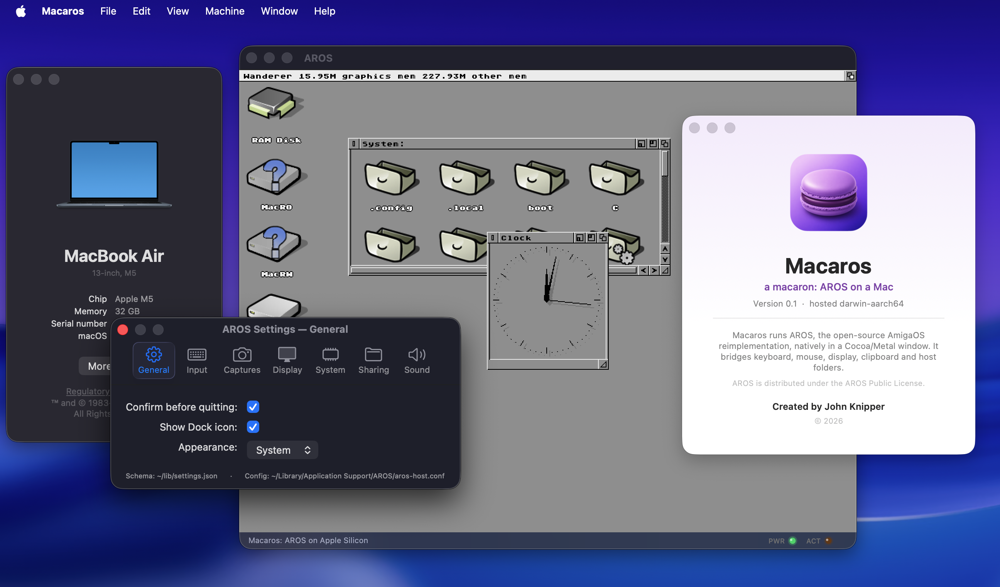

# AROS-AArch64 — AmigaOS on Apple Silicon

AROS-AArch64 brings [AROS](https://aros.org) — the open-source AmigaOS
reimplementation — to 64-bit ARM (AArch64), with the goal of running AmigaOS as a
**native app on Apple Silicon**: the Mac owns the drivers, and AROS reaches them
through standard exec I/O.

This repo is the **graft / host layer**. The AROS operating-system source we
modify lives in a *separate sibling* checkout (`../aros-upstream`, branch
`aarch64-darwin-graft`) — a fork of AROS at
[github.com/jonx/AROS](https://github.com/jonx/AROS/tree/aarch64-darwin-graft);
see [Repository layout](#repository-layout).

> **New here?** Start with **[GETTING-STARTED.md](GETTING-STARTED.md)** — a
> newcomer's path from an empty Mac to a running system (source → toolchain →
> build → run).

## Objectives

1. **A native AArch64 backend for AROS** — vectors, MMU, context switch, exception
   model on 64-bit ARM. Greenfield, reusable on *every* ARM64 target, and the
   genuine standalone contribution (AROS's first native AArch64 bring-up).
2. **Run AmigaOS as a native macOS app on Apple Silicon** — AROS as an arm64
   process, *hosted*: macOS owns every driver and AROS reaches them via standard
   exec I/O. Going hosted is deliberate — it sidesteps the undocumented
   Apple-Silicon hardware almost entirely (see the two hard problems below).
3. **Toward an embeddable, scriptable AROS** — an engine/shell split so AmigaOS
   can be driven and embedded, not just booted. Direction:
   [hosted/libaros/IDEAS.md](hosted/libaros/IDEAS.md).

### The one rule that shapes everything

> An AI agent must be able to run the **whole loop unattended** — build → boot →
> observe → judge — with **no manual step**.

Every design decision serves that rule. It's why the hard CPU work happens on QEMU
(which exposes the machine programmatically — serial, QMP, gdbstub) rather than on
a locked-down MacBook, and why the hosted side always keeps a *programmatic* pixel
channel beside any on-screen window (a live window can't be verified by
screen-capture without a manual permission click). Rationale:
[ROADMAP.md](ROADMAP.md), [NOTES.md](NOTES.md).

### Two hard problems — never worked at once

1. **The AArch64 CPU backend** — greenfield, reusable on every ARM64 target.
2. **Apple Silicon specifics** — undocumented hardware, custom interrupt
   controller, signed boot. Deferred as long as possible.

The arc keeps them apart: do the CPU backend entirely on QEMU, then reach the Mac
by going *hosted*, which sidesteps the Apple-specific hardware. Native-on-bare-
Apple-Silicon is explicitly a non-goal.

### The thesis

*macOS owns the drivers; AROS reaches them via standard exec I/O.* Every hosted
feature — display, clipboard, audio, sockets, volumes — is that one idea applied
to one more surface, and every one must verify in the unattended loop.

## Status — what works today



*One arm64 macOS app.* The window in the middle is the real **AROS Wanderer**
desktop — its host volumes (`RAM Disk`, plus `MacRO` and `MacRW`: two Mac folders
mounted read-only and read-write), the `System:` drawer, and a live Clock — drawn
into a Cocoa/Metal window. Around it is **Macaros**, the Mac app that hosts it: the
menu bar, the About panel (the macaron), and a native, schema-driven **AROS
Settings** window. It is all a single hosted arm64 process on an M-series
MacBook — *macOS owns the drivers; AROS reaches them via standard exec I/O.*

- **Real AROS boots on Apple Silicon** as a native arm64 macOS process — exec /
  kernel.resource / hostlib / dos.library / the full boot module set come up,
  SYS: mounts, and the **AmigaDOS Shell reads typed commands and runs them**. The
  full standard **C: command set (116 commands)** is installed. Multitasking,
  W^X executable loading, and console I/O all work. Full state:
  [graft/CONTINUATION.md](graft/CONTINUATION.md).
- **A live Cocoa/Metal window** ([cocoa-metal-display](docs/features/cocoa-metal-display/design.md)) —
  the AROS console renders in a Mac window (Apple-native AppKit + Metal) and the
  keyboard drives the shell. Launch with [`graft/run-window.sh`](graft/run-window.sh).
- **Macaros — a first-class Mac app** ([host-app-shell](docs/features/host-app-shell/design.md)) —
  menu bar, About, custom icon, and schema-driven Settings, packaged as a
  double-clickable `.app` by [`graft/make-aros-app.sh`](graft/make-aros-app.sh).
- **Clipboard bridge** ([clipboard-bridge](docs/features/clipboard-bridge/README.md)) —
  two-way copy/paste between the macOS `NSPasteboard` and AROS `clipboard.device`.
- **`aros-ctl` — the control harness** ([control-harness](docs/features/control-harness/README.md)) —
  drives the windowed AROS headlessly (type, click, screenshot the framebuffer,
  tail the log) with no window-server session and no Screen-Recording prompt, so
  the GUI stays inside the unattended loop. Built and in daily use:
  [`graft/aros-ctl`](graft/aros-ctl).
- **`run68k` — a 68k→AArch64 JIT** that runs self-contained classic-Amiga **68k**
  binaries (integer **and** 68881/68882 hardware FP) natively on Apple Silicon,
  byte-exact-verified. See [Run classic 68k software](#run-classic-68k-software--run68k).

## Quick start

Full newcomer walkthrough: **[GETTING-STARTED.md](GETTING-STARTED.md)**. The short
version:

```sh
brew install qemu llvm lld           # clang + ld.lld + lldb + qemu-system-aarch64

# --- 68k JIT (no AROS build needed — instant) ---
make run68k                          # -> build/run68k
build/run68k hosted/jit68k/apps68k/bin/mandel.exe   # runs a 68k Mandelbrot, exit 0

# --- The hosted Mac app (Apple Silicon) ---
# Building hosted AROS needs the OS source as a sibling checkout and a real
# configure — do NOT expect a one-shot script. See GETTING-STARTED.md §2–§4:
#   git clone -b aarch64-darwin-graft https://github.com/jonx/AROS.git ../aros-upstream
#   (configure /tmp/arosbuild --target=darwin-aarch64 --with-toolchain=llvm, build metatargets)
make cocoametal-dylib pasteboard-dylib coreaudio-dylib bsdsock-dylib   # host shims -> build/
graft/aros-ctl deploy                # stage the shims + Cocoa monitor into the boot tree
AROS_CTL_STARTUP_MODE=desktop graft/run-window.sh   # boot AROS in a live Cocoa/Metal window
graft/make-aros-app.sh               # …or package it as a double-clickable Macaros.app
graft/aros-ctl run                   # …or drive the window headlessly (type/click/shot)

# --- The AArch64 backend on QEMU (Act 1 foundation) ---
make run                             # build an AArch64 ELF, boot on QEMU, verify latest milestone
make test                            # boot once, assert every milestone marker
make hosted-test                     # build + run every hosted spike (H1–H12)
```

> ⚠️ There is no single "build hosted AROS" script. The OS is built from the
> `../aros-upstream` checkout with a real `configure` + module **metatargets** in a
> stable build dir — read [docs/features/build/README.md](docs/features/build/README.md)
> **first** (a bare `make` tries to rebuild the 1–2 h LLVM toolchain and breaks).

The hosted build dir lives **outside** the repo (default `/tmp/arosbuild`); the
run scripts discover it, or you point them at it with `AROS_CTL_BOOTD`. The host
dylibs and entitlements travel with the checkout. Build specifics are in
[docs/features/build/README.md](docs/features/build/README.md); deploy/run and the
several-copies gotchas in [docs/features/deployment/README.md](docs/features/deployment/README.md).

## The arc — three acts

The objectives above were reached by separating the two hard problems and never
working both at once. Full reasoning in [ROADMAP.md](ROADMAP.md).

### Act 1 — AArch64 backend on QEMU `virt` ✅
A native 64-bit ARM bring-up on a fully observable target, each milestone gated by
the loop. Detail in [PHASE1.md](PHASE1.md); every hardware fact grounded against
the real DTB / Linux headers / QEMU source in [HARDWARE.md](HARDWARE.md).

| # | Milestone | What works |
|---|-----------|-----------|
| M1 | serial | EL1 entry, PL011 UART, clean semihosting exit |
| M2 | C runtime | `.bss`/stack, `kprintf` |
| M3 | exceptions | `VBAR_EL1`, vector table, SVC/BRK decode + recover |
| M4 | MMU | identity map, `SCTLR.M`, verified translation fault |
| M5 | timer IRQ | GICv2 + EL1 physical timer |
| M6 | phys memory | free-list page allocator |
| M7 | context switch | two cooperative tasks on separate stacks |
| M8 | shell | UART RX + injected-keystroke command loop |
| M9 | framebuffer | ramfb via fw_cfg, screendump-verified |
| M10 | preemption | SIGALRM-as-timer preemptive multitasking |

### Act 2 — Hosted spikes on macOS ✅
Rather than attempt the full port at once, **de-risk the scary parts
cheapest-first** — each a standalone, grounded, loop-verified spike (`make
hosted-*`, all green via `make hosted-test`). Detail in [PHASE2.md](PHASE2.md);
the spikes map into the real AROS tree in [GRAFT.md](GRAFT.md).

| # | Spike | What it proves |
|---|-------|----------------|
| H1/H2 | foundation + preemption | our context switch runs at EL0 in a macOS process; SIGALRM + `mcontext` swap → hosted preemption |
| H3 | host-call ABI | bridges AROS→Apple's arm64 variadic-on-stack ABI (the Darwin-PPC killer) |
| H4/H5/H6 | exec shapes | real `core_Schedule`/`cpu_Switch`; `MemHeader`/`MemChunk` over `mmap`; the two composed |
| H7 | display | AROS draws a framebuffer from its heap; macOS presents it |
| H8 | library/LVO | a tiny `exec.library` via the real jump-vector mechanism + `SetFunction` |
| H9–H12 | exec primitives | `Wait`/`Signal`, message ports, device→real-file `DoIO`, full exec boot |

### Act 3 — The graft (porting the real AROS tree) 🔄
Stop spiking and integrate the **real AROS source** for `darwin-aarch64`. This is
where "what works today" was won. The starter patch set and build status are in
[graft/README.md](graft/README.md); the integration map is
[GRAFT.md](GRAFT.md); the live, reproducible build recipe is
[graft/build-darwin-aarch64.sh](graft/build-darwin-aarch64.sh); the upstream-worthy
friction is logged in [graft/UPSTREAM-NOTES.md](graft/UPSTREAM-NOTES.md) and the
working method in [graft/WORKFLOW.md](graft/WORKFLOW.md).

## Hosted feature set

Each macOS host capability has a grounded **design** (the why + the AROS/Apple
contracts) and an implementation **spec** under [docs/features/](docs/features/README.md).
All apply the thesis — *macOS owns the drivers; AROS reaches them via standard
exec I/O* — and all must verify in the unattended loop.

| Feature | One-line | Docs | Status |
|---------|----------|------|--------|
| Cocoa/Metal display | a live macOS window (AppKit + Metal) for the AROS desktop | [design](docs/features/cocoa-metal-display/design.md) · [spec](docs/features/cocoa-metal-display/spec.md) · [interface](docs/features/cocoa-metal-display/INTERFACE.md) | **built** |
| Host app shell (Macaros) | menu bar, About, icon, two-tier Settings — a real Mac app | [design](docs/features/host-app-shell/design.md) · [spec](docs/features/host-app-shell/spec.md) | **built** |
| Clipboard bridge | two-way copy/paste, `NSPasteboard` ↔ `clipboard.device` | [README](docs/features/clipboard-bridge/README.md) · [design](docs/features/clipboard-bridge/design.md) · [spec](docs/features/clipboard-bridge/spec.md) | **built** |
| Control harness (`aros-ctl`) | puppet the windowed AROS headlessly, inside the loop | [README](docs/features/control-harness/README.md) · [design](docs/features/control-harness/design.md) · [spec](docs/features/control-harness/spec.md) | **built** |
| Host volume | a real Mac folder mounted as an AROS volume, drag-from-Finder | [README](docs/features/host-volume/README.md) · [design](docs/features/host-volume/design.md) · [spec](docs/features/host-volume/spec.md) | **built** |
| 68k JIT | host 68k→AArch64 translator for classic Amiga binaries (adopts [Emu68](THIRD-PARTY-NOTICES.md), MPL-2.0) | [design](docs/features/68k-jit/design.md) · [spec](docs/features/68k-jit/spec.md) · [interface](docs/features/68k-jit/INTERFACE.md) | **built** (`run68k`) |
| CoreAudio audio | real sound via a CoreAudio-backed AHI sub-driver | [README](docs/features/coreaudio-audio/README.md) · [design](docs/features/coreaudio-audio/design.md) · [spec](docs/features/coreaudio-audio/spec.md) | **built** |
| Host BSD sockets | working TCP/IP by forwarding `bsdsocket.library` to native sockets | [README](docs/features/bsdsocket-net/README.md) · [design](docs/features/bsdsocket-net/design.md) · [spec](docs/features/bsdsocket-net/spec.md) | **built** |
| Native media (ffmpeg) | decode-only `libav*` built for AROS + **FFViewX / FFView** image + video viewer | [README](docs/features/ffmpeg-native/README.md) | **built** |
| GPU 2D (gpufx) | GPU-accelerated YUV→RGB + scale via the cocoametal compute shim + a `gpufx.library` front door (5–7× the CPU path) | [README](docs/features/gpufx/README.md) | **started** |
| Rust on AROS | full Rust `std` runs natively — net/fs/env/args/process/time/thread, verified live | [README](docs/features/rust-aros/README.md) · [build a program](hosted/rust/BUILDING-PROGRAMS.md) | **built** |

Supporting docs: the [feature index](docs/features/README.md) · the
[CLEANROOM independent-work process](docs/features/CLEANROOM.md) that governs every
spec · the [host-wake pattern](docs/features/host-wake-pattern.md) shared by the
audio/socket/clipboard shims · [crash handling](docs/features/crash-handling/design.md) ·
the [Darwin AArch64 port inventory](docs/features/darwin-aarch64-port-inventory.md)
(gap map + active work order) ·
the [debug & bring-up tools](docs/features/debug-tools/README.md).

## Run classic 68k software — `run68k`

Beyond the AArch64 *backend*, the repo includes a **68k→AArch64 JIT** that runs
self-contained classic-Amiga **68k** programs — integer **and** 68881/68882
**hardware floating-point** — directly on Apple Silicon, including real
`vbcc`-compiled C, each byte-exact-verified against an independent interpreter.
The **`run68k`** CLI runs a 68k Amiga **hunk executable** straight from your terminal:

```sh
make run68k                                          # -> build/run68k
build/run68k hosted/jit68k/apps68k/bin/mandel.exe    # prints a Mandelbrot, exit 0
build/run68k hosted/jit68k/apps68k/bin/j5t.exe       # a vbcc-compiled hardware-FP program
```

The program's output goes to stdout (pipe-able), the exit code is the program's
own `D0`, and any fault writes a self-contained **crash-bundle** `.tar.gz`. It runs
*system-friendly* 68k software — a CPU+FPU JIT with a stub OS, not a full-chipset
emulator. **Full docs: [hosted/jit68k/run68k.md](hosted/jit68k/run68k.md)** ·
sample programs: [hosted/jit68k/apps68k/README.md](hosted/jit68k/apps68k/README.md) ·
design: [docs/features/68k-jit/](docs/features/68k-jit/design.md).

> **Third-party code:** unlike the rest of this repo, the JIT is **not**
> clean-room. Its 68k decoders and AArch64 emitter are adopted from
> **[Emu68](https://github.com/michalsc/Emu68) (MPL-2.0)**, vendored verbatim in
> `hosted/jit68k/emu68/` behind a documented license boundary; our engine, loader,
> and OS bridge link to them but copy no Emu68 code. Full disclosure:
> [THIRD-PARTY-NOTICES.md](THIRD-PARTY-NOTICES.md).

## Repository layout

Work spans **two sibling checkouts** — this repo (the host layer) and a separate
AROS OS-source tree (the [jonx/AROS](https://github.com/jonx/AROS/tree/aarch64-darwin-graft)
fork, branch `aarch64-darwin-graft`).

```
aros-aarch64/                     ← THIS repo (the graft / host layer)
├── boot/        Act-1 bare-metal AArch64 kernel: start.S, mmu.c, irq.c, task.c, fb.c …
├── harness/     the unattended loop: run.sh, run-hosted.sh, qmp.py, lldb-dump.sh, test.sh
├── hosted/      Act-2 spikes (host.c, preempt.c, abishim.*, exec.c …) + the real host shims:
│   ├── cocoametal/   the Cocoa/Metal display + Macaros app + control FIFO (dylib)
│   ├── clipboard/    the NSPasteboard ↔ clipboard.device bridge (libpasteboard.dylib)
│   ├── hostvolume/   the Mac-folder-as-AROS-volume handler
│   ├── coreaudio/    CoreAudio AHI sub-driver shim          (see also hostshell/, libaros/)
│   ├── bsdsocket/    bsdsocket.library → native sockets pump
│   ├── ffmpeg/       libav* built native for AROS + FFViewX/FFView viewer
│   ├── gpufx/        GPU 2D (YUV→RGB + scale) compute shim + gpufx.library
│   ├── rust/         Rust std port for AROS + the RustHello sample   (STD-PORT.md)
│   └── jit68k/       the 68k→AArch64 JIT + the run68k CLI    (run68k.md)
├── graft/       the AArch64-darwin patch set + build/run scripts for the OS tree:
│   ├── build-darwin-aarch64.sh / run-window.sh / make-aros-app.sh / make-aros-release.sh / aros-ctl
│   ├── cpu_aarch64.h, cpucontext-aarch64.h, configure-darwin-aarch64.diff   (seed patches)
│   └── README.md, WORKFLOW.md, UPSTREAM-NOTES.md, CONTINUATION.md, cocoa-display-handoff.md
├── docs/features/   grounded design + spec per host capability (table above)
└── ROADMAP / PHASE1 / PHASE2 / GRAFT / HARDWARE / NOTES   the planning + decision log

../aros-upstream/                 ← the actual AROS OS source — jonx/AROS fork, branch aarch64-darwin-graft
                                     rom/, workbench/, arch/all-darwin, arch/aarch64-all …
                                     edited & committed there; clone with:
                                       git clone -b aarch64-darwin-graft https://github.com/jonx/AROS.git ../aros-upstream
```

### Doc map — start here

| If you want… | Read |
|--------------|------|
| To get from an empty Mac to a running system | [GETTING-STARTED.md](GETTING-STARTED.md) |
| The big-picture arc & rationale | [ROADMAP.md](ROADMAP.md) |
| The architecture + decision log (and bugs grounding caught) | [NOTES.md](NOTES.md) |
| The host-side code map (shims, spikes, what's built vs. an idea) | [hosted/README.md](hosted/README.md) |
| Third-party code & licenses (the Emu68 / MPL-2.0 adoption) | [THIRD-PARTY-NOTICES.md](THIRD-PARTY-NOTICES.md) |
| Act-1 milestone checklist | [PHASE1.md](PHASE1.md) · [HARDWARE.md](HARDWARE.md) |
| Act-2 spike list | [PHASE2.md](PHASE2.md) |
| How the spikes map into the real AROS tree | [GRAFT.md](GRAFT.md) |
| Current hosted-AROS state (resume here) | [graft/CONTINUATION.md](graft/CONTINUATION.md) |
| The graft patch set & build status | [graft/README.md](graft/README.md) · [graft/WORKFLOW.md](graft/WORKFLOW.md) · [graft/UPSTREAM-NOTES.md](graft/UPSTREAM-NOTES.md) |
| The hosted features (built & planned) | [docs/features/README.md](docs/features/README.md) |
| Where AROS-as-an-embeddable-library is heading | [hosted/libaros/IDEAS.md](hosted/libaros/IDEAS.md) |

## Provenance & licensing

This repo is licensed under the **AROS Public License** ([LICENSE](LICENSE), APL
1.1, MPL-derived) — the same license AROS itself uses, so anything destined for
upstream carries over cleanly. The host-side feature work is **independent
work** — written from public APIs, published standards, the AROS tree, and this
project's own spikes, under the [independent-work process](docs/features/CLEANROOM.md);
no third-party implementation source was read or consulted, and any resemblance is
coincidental.

**One deliberate exception:** the 68k JIT (`run68k`) adopts **Emu68** (MPL-2.0) as
vendored, isolated files under a documented license boundary — it is not
clean-room, and its files are not AROS-licensed. This is the repo's only
third-party code; see **[THIRD-PARTY-NOTICES.md](THIRD-PARTY-NOTICES.md)** and
[hosted/jit68k/emu68/NOTICE](hosted/jit68k/emu68/NOTICE).

## Status & contributing

Experimental and actively developed, as a hobby project. Expect rough edges,
and read [SECURITY.md](SECURITY.md) before pointing it at anything sensitive.
Issues and small, focused PRs are welcome: see
[CONTRIBUTING.md](CONTRIBUTING.md). Release notes live in
[CHANGELOG.md](CHANGELOG.md).
</content>
