# WORKFLOW — bringing up a brand-new `darwin-aarch64` AROS target

A map of the whole process of porting AROS (the open-source AmigaOS) to a
**hosted `darwin-aarch64`** target — i.e. AROS running as a normal process on a
modern Apple-Silicon Mac. It's meant for the next person (or the next session):
follow the arrows top-to-bottom, and the **green** boxes are already done.

> **Status: AROS boots to a Wanderer desktop on Apple Silicon.** The native `AROSBootstrap`
> loader maps memory, relocates and runs the kickstart; `exec.library`,
> `kernel.resource` and `hostlib.resource` initialise (valid `SysBase`/`KernelBase`);
> the host-signal→AROS-trap path works (a SIGSEGV is caught and AROS prints its
> AArch64 register dump) and AROS's native Guru-Meditation alert renders. Boot now
> proceeds through the full boot module set and `dos.library`, mounts SYS:, runs the
> AmigaDOS Shell with the standard C: command set, and renders a full Wanderer desktop
> in a live Cocoa/Metal window (see the root README). Run it: `~/aros-darwin/run.sh`.

> **Legend** — 🟢 done · 🟡 in progress · ⚪ pending
> (Mermaid renders on GitHub; a plain-text table follows for terminal readers.)

## The pipeline

```mermaid
flowchart TD
    classDef done   fill:#2e7d32,stroke:#1b4d20,color:#ffffff;
    classDef active fill:#e6a700,stroke:#8a6500,color:#000000;
    classDef todo   fill:#37474f,stroke:#1c262b,color:#cfd8dc;

    subgraph P0["Phase 0 · Hosted spikes — prove the model on bare macOS"]
        S0["🟢 H3–H12 spikes: Apple variadic ABI, scheduler, memory,<br/>library, signal, msgport, device — over mmap + SIGALRM<br/>(hosted/)"]:::done
    end

    subgraph P1["Phase 1 · Graft the new target into the AROS tree"]
        G1["🟢 configure: add the darwin-aarch64 case<br/>(AROS order is arch-cpu ⇒ darwin-aarch64, NOT aarch64-darwin)"]:::done
        G2["🟢 cpu_aarch64.h — Darwin signal-context glue<br/>(__ss.x[29], fp, lr, sp, pc, cpsr; FP via __ns)"]:::done
        G3["🟢 Fix struct ExceptionContext to match<br/>Darwin _STRUCT_ARM_THREAD_STATE64 byte-for-byte"]:::done
        G4["🟢 Remove dead ACPICA fetch dep (404, gated everything)"]:::done
        G5["🟢 Bump default LLVM 11.0.0 → 20.1.0 (config/llvm_def)"]:::done
        G6["🟢 Write the missing lld-20.1.0 AROS patch (4 lines)"]:::done
        G7["🟢 fetch.sh: add curl connect/transfer timeouts"]:::done
        G8["🟢 Install host prereqs + llvm-objcopy shim<br/>(gawk, autotools, netpbm, libpng, gnu-sed, mako)"]:::done
    end

    subgraph P2["Phase 2 · Build the patched LLVM crosstools (clang + lld)"]
        C1["🟢 Pre-cache all LLVM 20.1.0 source tarballs"]:::done
        C2["🟢 ./configure --target=darwin-aarch64 --with-toolchain=llvm"]:::done
        C3["🟢 cmake-configure patched LLVM<br/>(adds llvm::Triple::AROS, AROSTargetInfo, AROS ToolChain)"]:::done
        C4["🟢 Compile libLLVM* + lld + clang static archives"]:::done
        C5["🟢 Compile LLVM tool targets + link clang-20 (108MB) & lld"]:::done
        C6["🟢 install/strip → real patched clang + lld in bin/"]:::done
        C7["🟢 make clean → reclaim the 16GB build tree"]:::done
    end

    subgraph P3["Phase 3 · The core AROS modules build"]
        K1["🟢 exec.library compiles + LINKS (175KB aarch64 AROS ELF)<br/>~12 dispatch/compile fixes + FullJumpVec trampoline bug"]:::done
        K2["🟢 AArch64 exec arch asm: stackswap.S, newstackswap.c,<br/>execstubs.s, genmodule.h library-call stubs"]:::done
        K3["🟢 kernel.resource compiles + LINKS (70KB aarch64 AROS ELF)<br/>kernel_cpu.h routing, AROS_GET_SP clang, cpu_aarch64.c sigs"]:::done
    end

    subgraph P4["Phase 4 · Boot it — the hosted runtime on Apple Silicon"]
        B1["🟢 Build AROSBootstrap loader (native arm64 Mach-O host exe)"]:::done
        B2["🟢 Apple Silicon memory: drop MAP_32BIT, RW MAP_PRIVATE<br/>(W^X: RWX anon refused; low 4GB unavailable)"]:::done
        B3["🟢 AArch64 ELF relocations in the loader<br/>(ABS/PREL/ADRP/ADD/LDST/CALL/MOVW)"]:::done
        B4["🟢 -mcmodel=large (kill GOT relocs for weak __aros_libreq_*)"]:::done
        B5["🟢 Force-load static C runtime (libkrnmem.a) into exec/<br/>kernel/hostlib — weak StdC stubs deref NULL StdCBase"]:::done
        B6["🟢 hostlib.resource in the kickstart"]:::done
        B7["🟢 AROS BOOTS: exec+kernel+hostlib up, valid SysBase/<br/>KernelBase, trap handler + Guru alert render 🎉"]:::done
    end

    subgraph P5["Phase 5 · Toward a usable system"]
        F1["🟡 Get past the cold-start SIGSEGV (X1=0 null deref)"]:::active
        F2["⚪ Add dos.library + the boot module set"]:::todo
        F3["⚪ Reach a shell / Workbench"]:::todo
        F4["⚪ Proper mmake rule for libkrnmem.a; upstream the fixes"]:::todo
    end

    S0 --> G1 --> G2 --> G3 --> G4 --> G5 --> G6 --> G7 --> G8
    G8 --> C1 --> C2 --> C3 --> C4 --> C5 --> C6 --> C7
    C7 --> K1 --> K2 --> K3
    K3 --> B1 --> B2 --> B3 --> B4 --> B5 --> B6 --> B7
    B7 --> F1 --> F2 --> F3 --> F4
```

## Why the toolchain is step zero

AROS does **not** compile with a stock compiler: its build uses spec-flags like
`-noposixc` and an internal `llvm::Triple::AROS` that only a **patched clang**
understands — stock Apple clang rejects them outright. So before a single line of
AROS can be built *for* aarch64, we must build *the compiler that builds AROS*.
That's all of Phase 2 (a ~16GB, hour-long LLVM compile). Everything in Phase 3+
stands on it.

## Status table (plain text)

| # | Step | Status | Where |
|---|------|--------|-------|
| 0 | Hosted spikes H3–H12 (ABI…device) | 🟢 done | `hosted/` |
| 1 | configure `darwin-aarch64` case | 🟢 done | `graft/configure-darwin-aarch64.diff` |
| 2 | Darwin signal-context glue | 🟢 done | `graft/cpu_aarch64.h` |
| 3 | Fix `ExceptionContext` layout | 🟢 done | `graft/cpucontext-aarch64.h` |
| 4 | Drop dead ACPICA dep | 🟢 done | `arch/all-native/acpica/mmakefile.src` |
| 5 | LLVM 11 → 20.1.0 | 🟢 done | `config/llvm_def` |
| 6 | lld-20.1.0 AROS patch | 🟢 done | `tools/crosstools/llvm/lld-20.1.0.src-aros.diff` |
| 7 | fetch.sh timeouts | 🟢 done | `scripts/fetch.sh` |
| 8 | Host prereqs + objcopy shim | 🟢 done | host env |
| 9 | configure + cmake patched LLVM | 🟢 done | build dir |
| 10 | Compile clang/lld archives | 🟢 done | build dir |
| 11 | Link clang-20 + tool targets | 🟢 done | crosstools installed |
| 12 | install/strip + clean | 🟢 done | real `clang`+`lld` |
| 12b | compiler-rt builtins (libclang_rt.builtins-aarch64) | 🟢 done | needed at link |
| 13 | `make kernel-exec` → **exec.library LINKS** | 🟢 done | 175KB aarch64 AROS ELF |
| 14 | AArch64 exec arch impl (stackswap/newstackswap/execstubs/genmodule) | 🟢 done | `arch/aarch64-all/exec/` |
| 15 | **kernel.resource LINKS** (kernel_cpu route, AROS_GET_SP, sigs) | 🟢 done | 70KB aarch64 AROS ELF |
| 16 | AROSBootstrap loader (native arm64 Mach-O) builds | 🟢 done | `kernel-bootstrap-hosted` |
| 17 | Apple Silicon memory mmap (drop MAP_32BIT, RW MAP_PRIVATE) | 🟢 done | `arch/all-unix/bootstrap/memory.c` |
| 18 | AArch64 ELF relocations in the loader | 🟢 done | `bootstrap/elfloader.c` |
| 19 | `-mcmodel=large` → kill GOT relocs for weak symbols | 🟢 done | build-dir `make.cfg` |
| 20 | Force-load static C runtime (libkrnmem.a) into exec/kernel/hostlib | 🟢 done | `rom/exec`, `rom/kernel`, `hostlib` mmakefiles |
| 21 | hostlib.resource in the kickstart | 🟢 done | `kernel-hostlib` |
| 22 | **AROS BOOTS** (exec+kernel+hostlib up, trap handler + alert render) | 🟢 done | `~/aros-darwin/run.sh` |
| 23 | Past the cold-start SIGSEGV; dos.library; reach a shell | 🟡 / ⚪ | Phase 5 |

## Related docs

- [GRAFT.md](../GRAFT.md) — the map from AROS internals to the new target.
- [graft/README.md](README.md) — the starter patch set, with honest build status.
- [graft/UPSTREAM-NOTES.md](UPSTREAM-NOTES.md) — build-system friction worth fixing
  upstream (the `-g` bloat, the dead ACPICA dep, fetch hangs, the bit-rotted darwin
  backend, the AArch64-isn't-a-darwin-target gap…).

---

*Keep this current: when a ⚪/🟡 step lands, flip it 🟢 in both the diagram and the
table. The arrows are the contract; the colours are the progress.*
