# WORKFLOW — bringing up a brand-new `darwin-aarch64` AROS target

A map of the whole process of porting AROS (the open-source AmigaOS) to a
**hosted `darwin-aarch64`** target — i.e. AROS running as a normal process on a
modern Apple-Silicon Mac. It's meant for the next person (or the next session):
follow the arrows top-to-bottom, and the **green** boxes are already done.

> **Legend** — 🟢 done · 🟡 in progress · ⚪ pending
> (Mermaid renders on GitHub; a plain-text table follows for terminal readers.)

## The pipeline

```mermaid
flowchart TD
    classDef done   fill:#2e7d32,stroke:#1b4d20,color:#ffffff;
    classDef active fill:#e6a700,stroke:#8a6500,color:#000000;
    classDef todo   fill:#37474f,stroke:#1c262b,color:#cfd8dc;

    subgraph P0["Phase 0 · Hosted spikes — prove the model on bare macOS"]
        S0["🟢 H3–H12 spikes: Apple variadic ABI, scheduler, memory,<br/>library, signal, msgport, device — over mmap + SIGALRM<br/>(hosted/)"]:::done
    end

    subgraph P1["Phase 1 · Graft the new target into the AROS tree"]
        G1["🟢 configure: add the darwin-aarch64 case<br/>(AROS order is arch-cpu ⇒ darwin-aarch64, NOT aarch64-darwin)"]:::done
        G2["🟢 cpu_aarch64.h — Darwin signal-context glue<br/>(__ss.x[29], fp, lr, sp, pc, cpsr; FP via __ns)"]:::done
        G3["🟢 Fix struct ExceptionContext to match<br/>Darwin _STRUCT_ARM_THREAD_STATE64 byte-for-byte"]:::done
        G4["🟢 Remove dead ACPICA fetch dep (404, gated everything)"]:::done
        G5["🟢 Bump default LLVM 11.0.0 → 20.1.0 (config/llvm_def)"]:::done
        G6["🟢 Write the missing lld-20.1.0 AROS patch (4 lines)"]:::done
        G7["🟢 fetch.sh: add curl connect/transfer timeouts"]:::done
        G8["🟢 Install host prereqs + llvm-objcopy shim<br/>(gawk, autotools, netpbm, libpng, gnu-sed, mako)"]:::done
    end

    subgraph P2["Phase 2 · Build the patched LLVM crosstools (clang + lld)"]
        C1["🟢 Pre-cache all LLVM 20.1.0 source tarballs"]:::done
        C2["🟢 ./configure --target=darwin-aarch64 --with-toolchain=llvm"]:::done
        C3["🟢 cmake-configure patched LLVM<br/>(adds llvm::Triple::AROS, AROSTargetInfo, AROS ToolChain)"]:::done
        C4["🟢 Compile libLLVM* + lld + clang static archives"]:::done
        C5["🟡 Compile LLVM tool targets + link clang-20 (108MB) & lld"]:::active
        C6["⚪ install/strip → real patched clang + lld in bin/"]:::todo
        C7["⚪ make clean → reclaim the 16GB build tree"]:::todo
    end

    subgraph P3["Phase 3 · First real AArch64 module — where the OS port begins"]
        K1["⚪ make kernel-exec (build exec.library for darwin-aarch64)"]:::todo
        K2["⚪ Fill the AArch64 gaps:<br/>kernel_cpu.h __aarch64__ case · traphandler.c sp-align ·<br/>preparecontext.c · createcontext.c (drop x86 FPU asm) ·<br/>stackswap.S · execstubs.s"]:::todo
        K3["⚪ Iterate build→fix until exec.library compiles clean"]:::todo
    end

    subgraph P4["Phase 4 · Toward a booting hosted AROS"]
        B1["⚪ Build kernel.resource + the rest of the core modules"]:::todo
        B2["⚪ Link AROS; modernise the ~2010-Xcode darwin hosted backend"]:::todo
        B3["⚪ Boot AROS hosted on Apple Silicon 🎉"]:::todo
    end

    S0 --> G1 --> G2 --> G3 --> G4 --> G5 --> G6 --> G7 --> G8
    G8 --> C1 --> C2 --> C3 --> C4 --> C5 --> C6 --> C7
    C7 --> K1 --> K2 --> K3
    K3 --> B1 --> B2 --> B3
```

## Why the toolchain is step zero

AROS does **not** compile with a stock compiler: its build uses spec-flags like
`-noposixc` and an internal `llvm::Triple::AROS` that only a **patched clang**
understands — stock Apple clang rejects them outright. So before a single line of
AROS can be built *for* aarch64, we must build *the compiler that builds AROS*.
That's all of Phase 2 (a ~16GB, hour-long LLVM compile). Everything in Phase 3+
stands on it.

## Status table (plain text)

| # | Step | Status | Where |
|---|------|--------|-------|
| 0 | Hosted spikes H3–H12 (ABI…device) | 🟢 done | `hosted/` |
| 1 | configure `darwin-aarch64` case | 🟢 done | `graft/configure-darwin-aarch64.diff` |
| 2 | Darwin signal-context glue | 🟢 done | `graft/cpu_aarch64.h` |
| 3 | Fix `ExceptionContext` layout | 🟢 done | `graft/cpucontext-aarch64.h` |
| 4 | Drop dead ACPICA dep | 🟢 done | `arch/all-native/acpica/mmakefile.src` |
| 5 | LLVM 11 → 20.1.0 | 🟢 done | `config/llvm_def` |
| 6 | lld-20.1.0 AROS patch | 🟢 done | `tools/crosstools/llvm/lld-20.1.0.src-aros.diff` |
| 7 | fetch.sh timeouts | 🟢 done | `scripts/fetch.sh` |
| 8 | Host prereqs + objcopy shim | 🟢 done | host env |
| 9 | configure + cmake patched LLVM | 🟢 done | build dir |
| 10 | Compile clang/lld archives | 🟢 done | build dir |
| 11 | Link clang-20 + tool targets | 🟡 in progress | build dir |
| 12 | install/strip + clean | ⚪ pending | → real `clang`+`lld` |
| 13 | `make kernel-exec` (exec.library) | ⚪ pending | first AArch64 module |
| 14 | Port AArch64 module gaps | ⚪ pending | `arch/aarch64-all/{exec,kernel}` |
| 15 | More modules → link → boot | ⚪ pending | Phase 4 |

## Related docs

- [GRAFT.md](../GRAFT.md) — the map from AROS internals to the new target.
- [graft/README.md](README.md) — the starter patch set, with honest build status.
- [graft/UPSTREAM-NOTES.md](UPSTREAM-NOTES.md) — build-system friction worth fixing
  upstream (the `-g` bloat, the dead ACPICA dep, fetch hangs, the bit-rotted darwin
  backend, the AArch64-isn't-a-darwin-target gap…).

---

*Keep this current: when a ⚪/🟡 step lands, flip it 🟢 in both the diagram and the
table. The arrows are the contract; the colours are the progress.*
